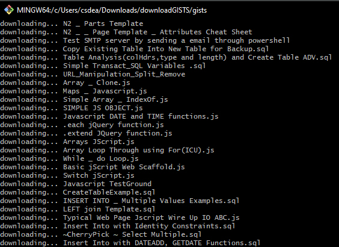

# Download-All-Gists-Node.JS-Script
Download all of your github gists locally

This is a little Node.js script to download all your github gists locally.
1. clone this repo : git clone https://github.com/csdear/Download-All-Gists-Node.JS-ScriptS.git  
2. Install dependencies : npm install
3. Add your github username and token to the .env file
4. Run the script : node downloadGISTSNODE.js

Your gists will be downloaded to the ./gists folder.

